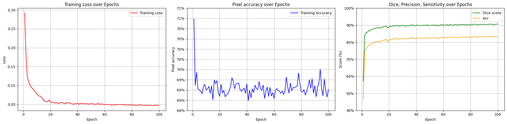
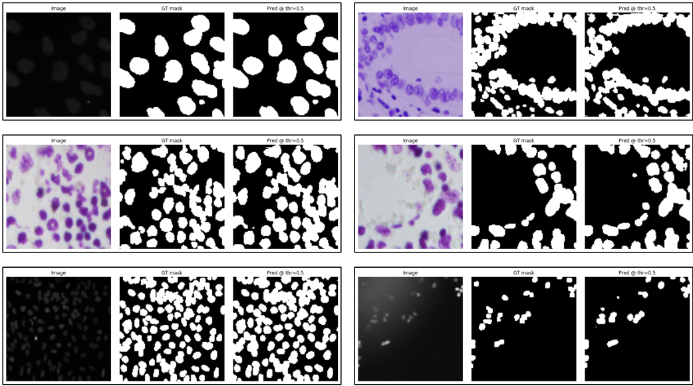

# ***Lite U-Net++***
Lightweight variant to U-Net++, inspired by U-Lite for semantic segmentation

## **Overview**
This model was coded based off U-Net++ in *UNet++: A Nested U-Net Architecture
for Medical Image Segmentation* by Zongwei Zhou, Md Mahfuzur Rahman Siddiquee,
Nima Tajbakhsh, and Jianming Liang and some of U-Lite modules in *1M PARAMETERS ARE ENOUGH? A LIGHTWEIGHT CNN-BASED
MODEL FOR MEDICAL IMAGE SEGMENTATION* by Binh-Duong Dinh, Thanh-Thu Nguyen, Thi-Thao Tran, Van-Truong Pham.

By substituting the original convolution block in U-Net with U-Lite's Axial Depth-wise Convolution module, the model successfully reduce the number of parameters from 8.9M (my code version of U-Net++) to a little over 1.1M, if the filters are halved, the number of parameters is only about 300k, which is incredibly small with respect to the proposed U-Net++.

## **Model details**

**Features**
1. **Deep supervision** for decoder heads
2. **Squeeze-and-Excitation (SE)** blocks
3. **Composite loss**: Focal + Focal-Tversky + Boundary (weights configurable)
4. **Evaluation**: Global Dice (F1) and IoU

**Dataset**
- Dataset used is [**Data Science Bowl 2018 Nuclei dataset**](https://www.kaggle.com/datasets/sinjoysaha/nucleiimagesmasksfromdsb2018). This dataset is different from the original since the masks of different nulcei have been merged for each image and the new dataset for the sake of convenience. 

**Augmentation**
- Random Cropping
- Random horizontal flip
- Random vertical flip
- Random rotation
- Normalization of the input image

## **Training**
**Setup**
- Python: **3.11**
- PyTorch: **2.5.1+cu121**
- GPU: **RTX 4070 Super**

**Hyperparameters**
- Epochs: **100**
- Learning rate: **0.001**
- Scheduler: **ReduceLROnPlateau** (reduce LR by scaling 0.8 on validation plateau)

**Result** of ***Semantic Segmentation***
- Dice score = 90.7 $\pm$ 0.1\%
- IoU score = 83.4 $\pm$ 0.1\%

**Plotting training results**

    
  <em> Plots of metrics and loss </em>

**Visualization of segmented outputs**

    
  <em> Segmented predictions </em>

## **References**
- U-Net++ model: https://arxiv.org/abs/1807.10165
- U-Lite model: https://arxiv.org/pdf/2306.16103
- Boundary loss: https://arxiv.org/abs/1812.07032
- Focal Tversky loss: https://arxiv.org/abs/1810.07842
- Focal loss: https://arxiv.org/abs/1708.02002

